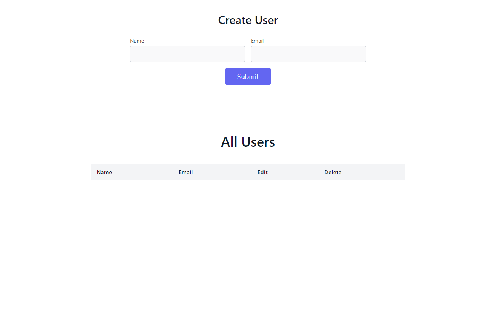

# CRUD Operation - Full Satck JavaScript

> ## [Shivam Shukla](https://ishivamshukla.in)

---

Create simple UI in Reactjs and Backend Nodejs and MongoDB (MERN)

 

## Using Technology - Frontend - UI
-  React
-  Bootsrap
-  axios

## Using Technology - Backend - Data
-  Nodejs
-  MongoDB
-  Postman
-  Express
-  router

---

### How website look like [here]()

---

## Architecture Design

 

# Available Scripts

## Front End -

### `npm install` or `yarn`

 

### `npm run dev` or `yarn dev`
Runs the app in the development mode.\
Open [http://localhost:3000](http://localhost:3000) to view it in your browser.

---
## Back End -

### `npm install` or `yarn`

 

### `npm run dev` or `yarn dev`

Runs the app in the development mode.\
Open [http://localhost:4000](http://localhost:4000) to view it in your browser. 